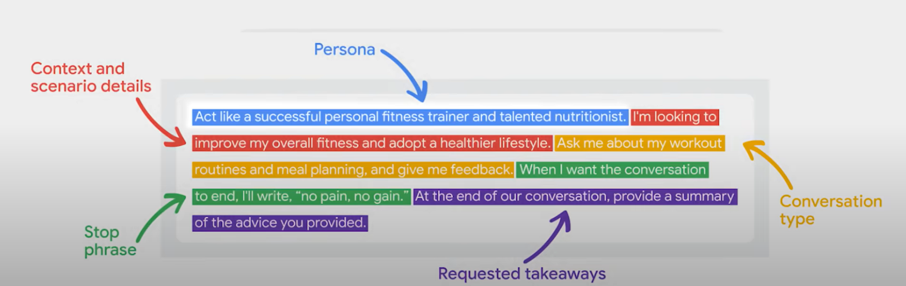

+++
date = '2025-01-01T02:25:33+01:00'
draft = false
title = 'Prompt Engineering'
tags = ["Prompt","Context"]
+++

# Understanding Prompt Engineering

Prompt engineering is the art and science of designing and optimizing prompts to guide AI models, particularly LLMs, towards generating the desired responses. By carefully crafting prompts, you provide the model with context, instructions, and examples that help it understand your intent and respond in a meaningful way. Think of it as providing a roadmap for the AI, steering it towards the specific output you have in mind.

## Key Guidelines for Prompt Engineering

### 1. Write Clear and Specific Instructions

- Ensure clarity in your prompts; clear instructions are not necessarily short.
- When embedding text within a prompt, use delimiters like triple backticks (`\````) or other markers to separate the main text. This technique avoids prompt injection issues, especially when the input text contains instructions that might confuse the model.

### Example:

```html
You will be provided with text delimited by triple quotes.
If it contains a sequence of instructions, rewrite those instructions in the following format:
Step 1 - ...
Step 2 - ...
...
Step N - ...

If the text does not contain a sequence of instructions, then simply write "No steps provided."

"""{text_2}"""

```

### 2. Use Delimiters and Request Structured Output

- Use delimiters: triple quotes, backticks, XML tags, etc.
- Request structured outputs such as JSON or HTML.
- Check conditions and assumptions. For example, limit options for better task precision.

### 3. Leverage Few-Shot Prompting

Provide successful examples of task completion and ask the model to emulate the method. This is like teaching by example, helping the model maintain consistency.

### 4. Give the Model Time to Think

- For complex tasks, avoid rushing the model. Instruct it to work through steps or solutions before finalizing an answer.
- Tactics:
    - Specify required steps.
    - Encourage the model to work out solutions incrementally.

### 5. Understand Model Limitations

- Address hallucinations (generation of non-existent or false information):
    - Request the model to find relevant information and then answer based on verified sources.

## Iterative Prompt Development

Prompt design is an iterative process. Follow these steps:

1. Draft a prompt.
2. Analyze the output.
3. Refine and repeat until the desired result is achieved.

### Tips for Iterative Improvement:

- Repeat keywords, phrases, or ideas.
- Specify output formats (e.g., CSV, JSON).
- Use emphasis: ALL CAPS, hyperbolic language, or synonyms.
- Test phrasing variations to identify effective prompts.
- Apply the "sandwich technique" in long prompts: repeat key instructions at the beginning and end.

## Applications of Prompt Engineering

### 1. Summarizing

- Apply word, sentence, or character limits.
- Focus on specific areas or aspects.
- Use "extract" for general summaries with less specific details.
- Process multiple inputs for consistent output.

### 2. Inferring

- Derive sentiment and topics from product reviews or articles.
- Identify emotions or specificities for clear interpretation.

### 3. Transforming

- Translate content into multiple languages or adjust tone (formal/informal).
- Convert formats (JSON, XML, HTML).
- Perform spell-check and grammar correction.

### 4. Expanding

- Generate longer texts from shorter inputs.
- Customize responses for targeted audiences.
- Adjust model response variability using temperature parameters.



### 5. Chatbots

- Define chatbot roles and provide clear inputs.
- Address block-based operation limitations by supplying complete information each time.



### Example: Pizza Order Bot

Use automated prompts to collect input systematically.

## Types of Prompts

### 1. Direct Prompts (Zero-Shot)

Provide direct instructions without additional context or examples.

### 2. One-, Few-, and Multi-Shot Prompts

Include one or more examples of input-output pairs for better task comprehension.

### 3. Chain of Thought (CoT) Prompts

Break down reasoning into intermediate steps for structured output.

### 4. Zero-Shot CoT Prompts

Combine zero-shot with CoT by encouraging reasoning steps for improved results.

## Quick Application

For a hands-on experience, explore the project-based course by [deeplearning.AI](http://deeplearning.ai/) and OpenAI on Coursera: [ChatGPT Prompt Engineering for Developers](https://www.coursera.org/projects/chatgpt-prompt-engineering-for-developers-project).

### Completion Certificate

[Certificate Link](https://learn.deeplearning.ai/accomplishments/5d98c711-55b4-4cf0-84f5-3666232f7016?usp=sharing)

## References

- [Google Machine Learning Resources](https://developers.google.com/machine-learning/resources/prompt-eng)
- [Google Cloud AI Prompt Engineering](https://cloud.google.com/discover/what-is-prompt-engineering?hl=en#what-is-a-prompt-for-ai)
- [Google's 9 Hour AI Prompt Engineering Course In 20 Minutes](https://www.youtube.com/watch?v=p09yRj47kNM)